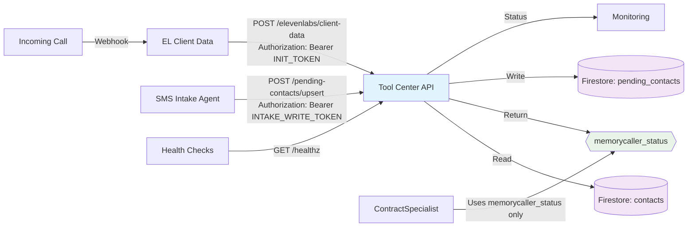

# BBP Tool Center (Google Cloud Run)

This service provides read-only client data to ElevenLabs agents and a write endpoint for SMS Intake to populate Firestore `pending_contacts`. Contracts, tokens, and schemas are stable to support additional tools.

## High-Level Flow



## Architecture & Separation of Concerns

### Services (Cloud Run)
- **tool-center-api** (this service)
  - `POST /elevenlabs/client-data` - Read-only, returns `memorycaller_status`
  - `POST /contacts/lookup` - Optional mirror for tools; read-only
  - `POST /pending-contacts/upsert` - Writes to `pending_contacts`; guarded for Intake agent only
  - `GET /healthz` - Health check endpoint

### Firestore Collections
- **contacts** - Read-only for ContractSpecialist; read + write for internal ops only
- **pending_contacts** - Write from Intake agent; read for humans/backoffice automation
- Document IDs: E.164 for `contacts` (`+1415...`), Firestore auto-IDs for `pending_contacts`

### Agent Roles
- **Intake subagent (SMS)**: Writes to `/pending_contacts` via validated endpoint
- **ContractSpecialist agent**: Calls `/elevenlabs/client-data` only (read-only lookup)

## Endpoints

### POST /elevenlabs/client-data

**Purpose**: ElevenLabs client initiation data webhook for caller context

**Auth**: `Authorization: Bearer <CALLER_INIT_TOKEN_V2>` (with fallbacks)

**Input**:
```json
{ "telephony": { "from": "+14155551212" } }
```

**Output**:
```json
{
  "type": "conversation_initiation_client_data",
  "dynamic_variables": {
    "memorycaller_status": {
      "business": "Builder's Business Partner",
      "createdAt": "2025-09-10T21:25:49.682Z",
      "cslb": "1234567",
      "digits": "14155551212",
      "isRegistered": true,
      "lastChannel": "voice",
      "name": "John Doe",
      "notes": "Preferred contact method is email",
      "phone_e164": "+14155551212",
      "source": "sms-intake",
      "tags": ["priority", "founder"],
      "updatedAt": "2025-09-10T21:26:11.226Z",
      "error": false
    }
  }
}
```

**Allowed Fields** (strict whitelist):
`business`, `createdAt`, `cslb`, `digits`, `isRegistered`, `lastChannel`, `name`, `notes`, `phone_e164`, `source`, `tags`, `updatedAt`, `error`

### POST /pending-contacts/upsert

**Purpose**: SMS intake upsert endpoint for new pending contacts

**Auth**: `Authorization: Bearer <INTAKE_WRITE_TOKEN>`

**Input**: Complete intake JSON with all required fields:
```json
{
  "raw_number": "(415) 555-1212",
  "phone_number": "+14155551212",
  "business_name": "ABC Construction LLC",
  "contact_name": "John Doe",
  "contact_email": "john@abcconstruction.com",
  "contact_method": "email",
  "is_repeat": false,
  "last_contact_date": "2025-09-10",
  "created_date": "2025-09-10",
  "call_count": 1,
  "license_number": "1234567",
  "business_address": "123 Main St, San Francisco, CA 94105",
  "trade_type": "General Contractor",
  "business_type": "LLC",
  "language_used": "English"
}
```

**Output**: 
```json
{ "ok": true, "id": "abc123def456" }
```

**Validation**:
- All required fields must be present
- `contact_email` must contain `@`
- `contact_method` ∈ `{"text", "phone", "email"}`
- `business_type` ∈ `{"LLC", "INC.", "Sole Proprietorship"}`
- `is_repeat` must be boolean
- `call_count` must be non-negative integer

### POST /contacts/lookup

**Purpose**: Optional read-only contact lookup for tools

**Auth**: `Authorization: Bearer <READ_SECRET>`

**Input**:
```json
{ "phone_e164": "+14155551212" }
```

**Output**:
```json
{
  "phone_e164": "+14155551212",
  "name": "John Doe",
  "business": "Builder's Business Partner",
  "cslb": "1234567",
  "isRegistered": true
}
```

### GET /healthz

**Purpose**: Health check endpoint (no auth required)

**Output**:
```json
{
  "status": "healthy",
  "timestamp": "2025-09-12T21:35:02.573Z",
  "service": "tool-center-api",
  "version": "1.0.0"
}
```

## Authentication & Security

### Tokens (Environment Variables)
- `CALLER_INIT_TOKEN_V2` - Client init read token (primary)
- `CALLER_REGISTRY_TOKEN` - Fallback read token
- `READ_SECRET` - General read operations
- `INTAKE_SECRET` - Legacy intake token
- `INTAKE_WRITE_TOKEN` - Dedicated write token for intake operations

### Token Priority (Client Data)
1. `CALLER_REGISTRY_TOKEN`
2. `CALLER_INIT_TOKEN_V2`
3. `READ_SECRET`
4. `INTAKE_SECRET`

### Header Formats Accepted
- `Authorization: Bearer <token>` (preferred)
- `Authorization: <token>` (fallback)
- `X-Auth-Token: <token>` (secondary fallback)

### Firestore Security
- Service Account: `sa-tool-center-api@contract-gen-prototype.iam.gserviceaccount.com`
- Collections have strict security rules with field-level validation
- Read-only access to `contacts`
- Validated write access to `pending_contacts`

## Testing

### Environment Setup
```bash
PROJECT_ID="contract-gen-prototype"
REGION="us-central1"
SERVICE="caller-registry-1085614446627"
BASE="https://caller-registry-1085614446627-1085614446627.us-central1.run.app"
TOKEN="$(gcloud secrets versions access latest --secret=CALLER_INIT_TOKEN_V2)"
WRITE_TOKEN="$(gcloud secrets versions access latest --secret=INTAKE_WRITE_TOKEN)"
```

### Acceptance Tests

#### T1: Client Data with Bearer Auth
```bash
curl -s -X POST "$BASE/elevenlabs/client-data" \
  -H "Content-Type: application/json" \
  -H "Authorization: Bearer $TOKEN" \
  -d '{"telephony":{"from":"+14152728956"}}'
```

#### T2: Auth Failure
```bash
curl -i -s -X POST "$BASE/elevenlabs/client-data" \
  -H "Content-Type: application/json" \
  -d '{"telephony":{"from":"+14152728956"}}'
```

#### T3: Fallback Headers
```bash
# Raw Authorization
curl -s -X POST "$BASE/elevenlabs/client-data" \
  -H "Content-Type: application/json" \
  -H "Authorization: $TOKEN" \
  -d '{"telephony":{"from":"+14152728956"}}'

# X-Auth-Token
curl -s -X POST "$BASE/elevenlabs/client-data" \
  -H "Content-Type: application/json" \
  -H "X-Auth-Token: $TOKEN" \
  -d '{"telephony":{"from":"+14152728956"}}'
```

#### T4: Bad Phone Number
```bash
curl -s -X POST "$BASE/elevenlabs/client-data" \
  -H "Content-Type: application/json" \
  -H "Authorization: Bearer $TOKEN" \
  -d '{"telephony":{"from":"not-a-number"}}'
```

#### T5: Pending Contact Upsert
```bash
curl -s -X POST "$BASE/pending-contacts/upsert" \
  -H "Content-Type: application/json" \
  -H "Authorization: Bearer $WRITE_TOKEN" \
  -d '{
    "raw_number": "(415) 555-1212",
    "phone_number": "+14155551212",
    "business_name": "Test Construction",
    "contact_name": "Test User",
    "contact_email": "test@example.com",
    "contact_method": "email",
    "is_repeat": false,
    "last_contact_date": "2025-09-12",
    "created_date": "2025-09-12",
    "call_count": 1,
    "license_number": "TEST123",
    "business_address": "123 Test St",
    "trade_type": "General",
    "business_type": "LLC",
    "language_used": "English"
  }'
```

#### T6: Health Check
```bash
curl -s "$BASE/healthz"
```

## Structured Logging

All events are logged in JSON format with the following structure:
```json
{
  "timestamp": "2025-09-12T21:35:02.573Z",
  "level": "info|warn|error",
  "event": "lookup_contact|auth_fail|validation_error|upsert_ok|client_data_error",
  "endpoint": "/elevenlabs/client-data",
  "details": { ... }
}
```

### Log Events
- `auth_fail` - Authentication failure
- `lookup_contact` - Contact lookup operation
- `validation_error` - Schema validation failure
- `upsert_ok` - Successful pending contact creation
- `client_data_error` - Error in client data endpoint
- `upsert_failed` - Failed pending contact creation

## Deployment

### Cloud Run Deployment
```bash
gcloud run deploy caller-registry-1085614446627 \
  --region us-central1 \
  --source . \
  --quiet
```

### Environment Variables Required
- `CONTACTS_COLLECTION` - Firestore collection name for contacts
- `PENDING_CONTACTS_COLLECTION` - Firestore collection name for pending contacts
- `PORT` - Server port (default: 8080)

### Secrets Required
- `CALLER_INIT_TOKEN_V2` - Primary client data token
- `INTAKE_WRITE_TOKEN` - Write operations token
- `READ_SECRET` - Read operations token

## Monitoring & Operations

### Health Monitoring
- Endpoint: `GET /healthz`
- Expected Response: `{"status": "healthy", ...}`
- Set up uptime checks against this endpoint

### Log Monitoring
```bash
# View recent logs
gcloud logging read \
  'resource.type="cloud_run_revision" resource.labels.service_name="caller-registry-1085614446627"' \
  --limit=50 --freshness=10m --format='value(textPayload)'

# Filter by event type
gcloud logging read \
  'resource.type="cloud_run_revision" AND jsonPayload.event="auth_fail"' \
  --limit=10
```

### Performance Considerations
- Set Cloud Run min instances to `1` for warm start
- Monitor concurrent requests and adjust max instances
- Track response times for client data lookups

## Future Extensibility

### Adding New Tools
1. Add route handler to `server.js`
2. Add entry to `tools.yaml` manifest
3. Update `openapi.yaml` specification
4. Add dedicated environment variable for auth token
5. Update Firestore security rules if needed

### Tool Registry Pattern
Each tool should follow this structure:
- **Route**: Express handler with validation
- **Auth**: Dedicated token with middleware
- **Schema**: Input/output validation
- **Logging**: Structured event logging
- **Documentation**: OpenAPI specification entry

## Files Structure

```
├── server.js           # Main Express application
├── tools.yaml          # Tool manifest and schemas
├── openapi.yaml        # OpenAPI 3.0 specification
├── firestore.rules     # Firestore security rules
├── package.json        # Node.js dependencies
├── Dockerfile          # Container configuration
└── README.md          # This documentation
```

## ElevenLabs Configuration

### Webhook URL
```
https://caller-registry-1085614446627-1085614446627.us-central1.run.app/elevenlabs/client-data
```

### Authentication Header
**Option 1 (Recommended)**: 
- Type: **Value**
- Name: `Authorization`
- Value: `Bearer <CALLER_INIT_TOKEN_V2>`

**Option 2**: 
- Type: **Secret**
- Name: `X-Auth-Token`
- Secret: `CALLER_INIT_TOKEN_V2`

Both configurations are supported and will work with the current implementation.

---

## Quick Start Checklist

- [ ] Deploy to Cloud Run with proper service account
- [ ] Configure environment variables and secrets
- [ ] Set up Firestore security rules
- [ ] Configure ElevenLabs webhook URL and auth
- [ ] Set up monitoring and health checks
- [ ] Run acceptance test suite
- [ ] Configure SMS Intake agent with write token
- [ ] Set up log monitoring and alerting